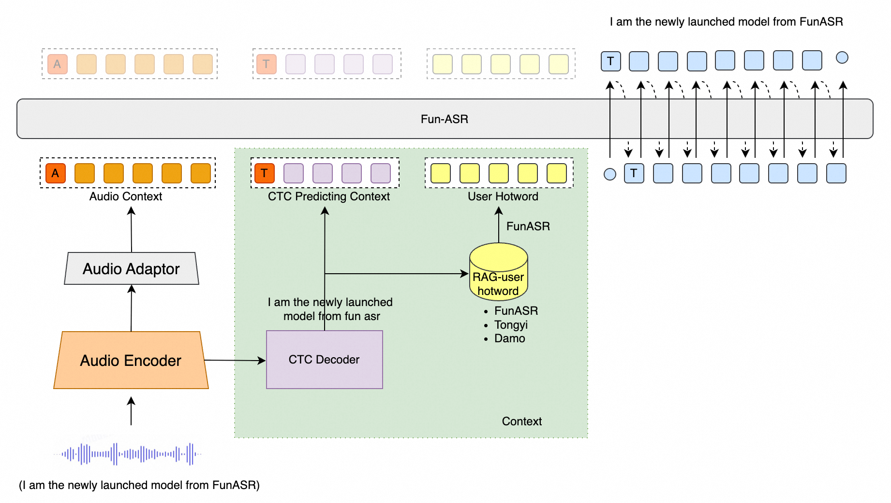

# Fun-ASR

「[简体中文](README_zh.md)」|「[English](README.md)」|「日本語」

> **FunASR 1.3.28:** リアルタイム WebSocket サーバーは、VAD で確定した最終デコードが悪化した場合に安定したテキストを保持し、`STOP` 受信時に短い末尾音声をデコードし、接続終了を明示的に処理します。`pip install -U "funasr==1.3.28"` でインストールしてください。[リリースノート](https://github.com/modelscope/FunASR/releases/tag/v1.3.28) · [デプロイガイド](https://www.funasr.com/en/blog/funasr-v1-3-28-realtime-websocket-subtitles.html) · [PyPI](https://pypi.org/project/funasr/1.3.28/)

Fun-ASRは通義実験室が開発したエンドツーエンド音声認識モデルファミリーです。チェックポイントごとに対応範囲が異なり、Fun-ASR-Nano-2512は中・英・日と中国語方言・地域アクセント、Fun-ASR-MLT-Nano-2512は31言語に対応します。どちらもFunASRから推論・配信できます。

<div align="center">

</div>

<div align="center">
<h4>
<a href="https://www.funasr.com/en/"> ホームページ </a>
｜<a href="#主要機能"> 主要機能 </a>
｜<a href="#性能評価"> 性能評価 </a>
｜<a href="#環境構築"> 環境構築 </a>
｜<a href="#使い方"> 使い方 </a>

</h4>

モデルリポジトリ：**Fun-ASR-Nano**（[ModelScope](https://www.modelscope.cn/models/FunAudioLLM/Fun-ASR-Nano-2512)、[Hugging Face](https://huggingface.co/FunAudioLLM/Fun-ASR-Nano-2512)、[GGUF](https://huggingface.co/FunAudioLLM/Fun-ASR-Nano-GGUF)） · **Fun-ASR-MLT-Nano**（[ModelScope](https://www.modelscope.cn/models/FunAudioLLM/Fun-ASR-MLT-Nano-2512)、[Hugging Face](https://huggingface.co/FunAudioLLM/Fun-ASR-MLT-Nano-2512)）

オンラインデモ：
[ModelScope Space](https://modelscope.cn/studios/FunAudioLLM/Fun-ASR-Nano)、[HuggingFace Space](https://huggingface.co/spaces/FunAudioLLM/Fun-ASR-Nano)

[](https://colab.research.google.com/github/QwenAudio/Fun-ASR/blob/main/examples/colab/fun_asr_nano_quickstart.ipynb)

[実行可能なサンプル](examples/README.md) では、クイックスタート推論、直接推論、話者分離、vLLM バッチ推論、Streaming SDK を確認できます。

</div>

| モデル | 対応タスク | 学習データ | パラメータ |
| :---: | :---: | :---: | :---: |
| Fun-ASR-Nano <br> ([⭐](https://www.modelscope.cn/models/FunAudioLLM/Fun-ASR-Nano-2512) [🤗](https://huggingface.co/FunAudioLLM/Fun-ASR-Nano-2512)) | 中国語・英語・日本語の音声認識。中国語は7方言・26地域アクセント対応。英語・日本語も複数地域アクセントに対応。歌詞認識・ラップ音声認識も搭載。 | 数千万時間 | 8億 |
| Fun-ASR-MLT-Nano <br> ([⭐](https://www.modelscope.cn/models/FunAudioLLM/Fun-ASR-MLT-Nano-2512) [🤗](https://huggingface.co/FunAudioLLM/Fun-ASR-MLT-Nano-2512)) | 中・英・粤・日・韓、ベトナム語、インドネシア語、タイ語、マレー語、フィリピン語、アラビア語、ヒンディー語など31言語の音声認識。 | 数十万時間 | 8億 |

CPU/エッジ端末では、Fun-ASR-Nano を llama.cpp / GGUF ランタイムで単一バイナリとして実行できます（Python/GPU 不要、内蔵 FSMN-VAD）。[funasr.com/llama-cpp](https://www.funasr.com/llama-cpp.html) · [Nano GGUF](https://huggingface.co/FunAudioLLM/Fun-ASR-Nano-GGUF) · [FSMN-VAD GGUF](https://huggingface.co/FunAudioLLM/fsmn-vad-GGUF)

<a name="主要機能"></a>

# 主要機能 🎯

- **遠距離・高ノイズ環境対応**：会議室、車内、工場など高ノイズ環境に最適化、認識精度 **93%** 達成
- **中国語方言・地域アクセント**：7大方言 + 26地域アクセントに対応
- **31言語多言語対応（MLT-Nano）**：東アジア・東南アジア言語を中心に31言語を認識
- **音楽背景下の歌詞認識**：音楽干渉下での音声認識性能を強化
- **ホットワード機能**：ドメイン固有用語の認識精度を向上
- **FunASRパイプラインによる話者分離**：独立したFSMN-VADとCAM++を組み合わせて話者ラベルを生成
- **vLLM推論エンジン**：バッチ推論で最大340倍リアルタイム速度

<a name="環境構築"></a>

# 環境構築 🐍

```shell
git clone https://github.com/QwenAudio/Fun-ASR.git
cd Fun-ASR
pip install -r requirements.txt
```

<a name="使い方"></a>

# 機能の境界

- **タイムスタンプ**：公開済みNano checkpointには学習済みCTC重みが含まれないため、checkpoint由来の文字単位タイムスタンプは信頼できません。正確な文字単位タイムスタンプにはParaformerを使用してください（[issue #106](https://github.com/QwenAudio/Fun-ASR/issues/106)）。
- **話者分離**：Nano/MLT checkpoint自体は話者ラベルを出力しません。FunASRで`fsmn-vad`と`cam++`を組み合わせます。

# 使い方 🛠️

## 基本的な推論

```python
from funasr import AutoModel

model = AutoModel(
    model="FunAudioLLM/Fun-ASR-Nano-2512",
    trust_remote_code=True,
    device="cuda:0",
    hub="hf"
)

result = model.generate(
    input=["audio.wav"],
    batch_size=1,
    language="日文",
)
print(result[0]["text"])
```

## FunASRパイプラインによる話者分離

この例ではFSMN-VADが音声を分割し、Fun-ASRが文字起こしし、CAM++が話者ラベルを付与します。`sentence_info`の区間はVADセグメント境界であり、checkpoint由来の文字単位タイムスタンプではありません。

```python
model = AutoModel(
    model="FunAudioLLM/Fun-ASR-Nano-2512",
    trust_remote_code=True,
    device="cuda:0",
    hub="hf",
    vad_model="fsmn-vad",
    spk_model="cam++",
    punc_model="ct-punc"
)

result = model.generate(input=["meeting.wav"], batch_size=1)
for item in result:
    if 'sentence_info' in item:
        for sent in item['sentence_info']:
            print(f"[話者{sent['spk']}] {sent['sentence']}")
```

## vLLM 高速推論

```python
from funasr.auto.auto_model_vllm import AutoModelVLLM

model = AutoModelVLLM(
    model="FunAudioLLM/Fun-ASR-Nano-2512",
    tensor_parallel_size=2,
)

results = model.generate(["audio1.wav", "audio2.wav"], language="日文")
```

詳細は [vLLM推論ガイド](docs/vllm_guide.md) をご参照ください。

<a name="性能評価"></a>

# 性能評価 📊

| モデル | GPUスピード | CPUスピード | vs Whisper-large-v3 |
|--------|-----------|-----------|-------------------|
| Fun-ASR-Nano (vLLM) | **340x** リアルタイム | — | 🚀 **26倍高速** |
| SenseVoice-Small | **170x** リアルタイム | **17x** リアルタイム | 🚀 **13倍高速** |
| Whisper-large-v3 | 13x リアルタイム | ❌ | 基準 |

## エコシステム

Fun-ASR-Nanoは **FunAudioLLM** ファミリーの一員です：

| プロジェクト | 説明 | Stars |
|-------------|------|-------|
| [FunASR](https://github.com/modelscope/FunASR) | 産業用音声認識ツールキット — VAD、ASR、句読点、話者分離 | [](https://github.com/modelscope/FunASR) |
| [SenseVoice](https://github.com/QwenAudio/SenseVoice) | 超高速ASR + 感情認識 + 音声イベント検出 | [](https://github.com/QwenAudio/SenseVoice) |
| [CosyVoice](https://github.com/QwenAudio/CosyVoice) | 自然音声生成 — 多言語、ゼロショットクローニング | [](https://github.com/QwenAudio/CosyVoice) |
| [FunClip](https://github.com/modelscope/FunClip) | AI音声認識による動画クリッピング | [](https://github.com/modelscope/FunClip) |

## ライセンス

[Apache 2.0](LICENSE)
